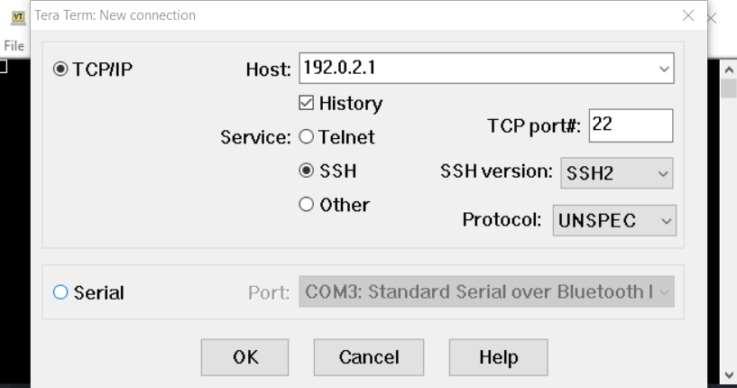
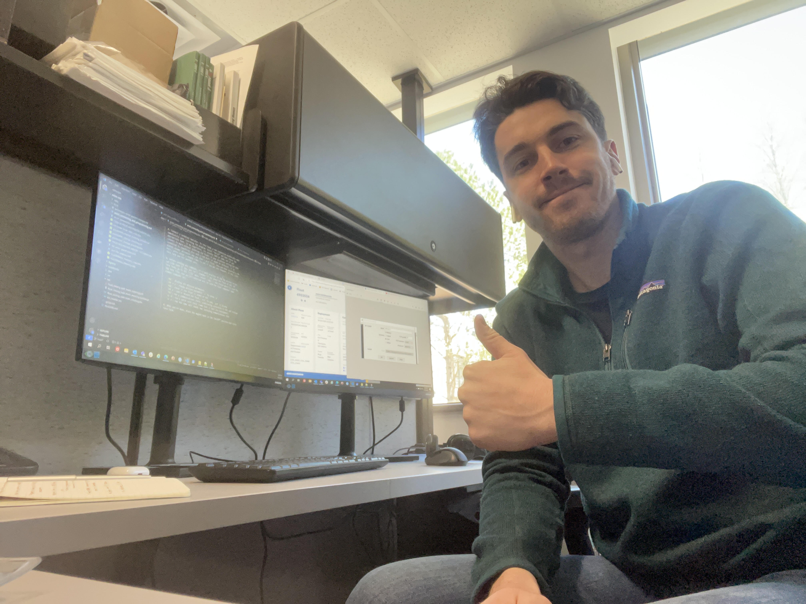

# NKE ARVOR Float: Connecting, Programming, and Troubleshooting via Bluetooth

Christopher Gordon, DFO, [chris.gordon@dfo-mpo.gc.ca](mailto:chris.gordon@dfo-mpo.gc.ca)

This document to guide a user on how to connect to an NKE ARVOR float,
hopefully simplifying the documentation in the float manual. A simple version
of the process is that you connect your laptop to the float via bluetooth,
just as you would headphones, a mouse, etc. Once connected, you will be able to
use a terminal emulator (I use [Tera Term](https://ttssh2.osdn.jp/index.html.en))
to query or program the float.

## Steps

1. Open bluetooth settings, select "Add Bluetooth or other device", then select
"Bluetooth"

2. Move the magnet on the float from the "On/Off" position on the float (midway
up the body of the flaot) to the "Bluetooth" position (just under the white
"head" of the float)

3. Pair to the float. The name of the float will (annoyingly) not be any of the
other number associated with the float like serial number, IMEI, or WMO, but
something totally different. It is typically a mix of numbers and letters and
dashes, for example "C210216-0138-AC", so look for that general structure and
press "pair". If you picked the right thing, they usually pair quite quickly.

Note: if the float is already armed, you can still pair to it but you will have
a limited time window (roughly a minute) to get paired to it. Once you are
successfully paired the float will realize it is not being deployed and stop
the launching sequence.

4. Connect a terminal emulator. In Tera Term, a new connection window will open
immediately upon launching the program. Select "Serial" and then choose the
appropriate Port. In my experience, its usually COM3 or COM4, but if you
connect to more without deleting old floats in your Bluetooth setting (or have
connected to something else with a COM Port) it might be different. It is
almost always whichever one you didn't pick first. Once you have selected a COM
Port, press enter a couple times to see if you get any response. If not, close
Tera Term and try another port.

5. Before sending any commands, it is good practice to log the session so you 
can look back if say, you can't remember if you armed the float or not. In
Tera Term, go to the "File" menu, select "Log..." and choose where to save the
log text file. Now you're connected and can send the float commands! Some 
common commands are:

- `?MC`: display all mission parameters
- `!MC x y`: change mission parameter `x` to value `y`
- `?AR`: check if the float is armed or not
- `!AR x`: arm or disarm the float, `x=1` to arm, `x=0` to disarm
- `!SE`: run a communications check, esablishing connection to GPS and Iridium
- `!C 0`: run a quick self check (same test it does pre-deployment)
- `!C 1`: run the same self check, but including communications test

6. When you're done, place the magnet back in the "On/Off" position and close
Tera Term.

Thanks!!
