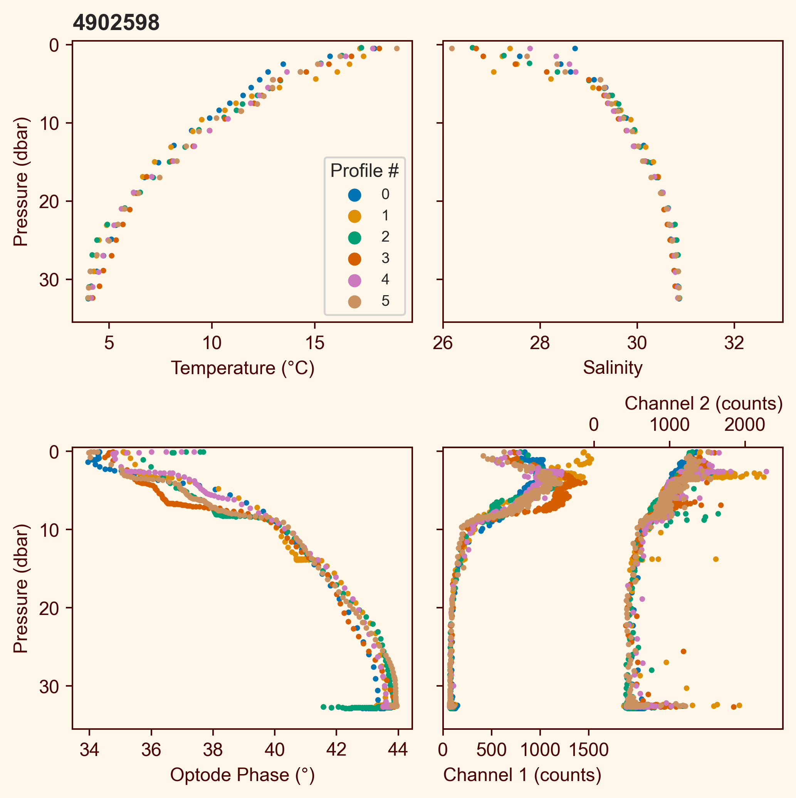
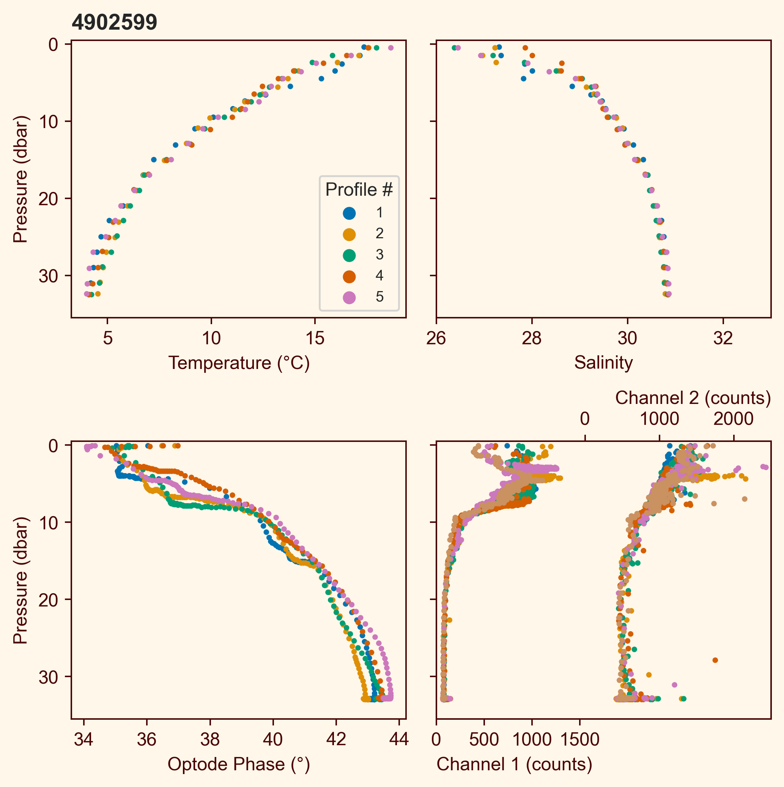

# Pre-Deployment Testing at DRDC Barge

**Chris Gordon**

## Setup, Programming, and Deployment

The DRDC barge has 4 davits, one on each corner of the moon pool. which are 
about 3m above the surface of the water. The Bedford Basin in this area is 
42m deep. From each davit, a weighted line measuring 38m is hung, making the 
maximum profiling depth for the float 35m. For the ARVOR floats, they can be 
programmed to profile and drift at this depth, however for the PROVOR floats,
the minimum profile and drift depth is 100m. This means that for these floats,
you must attached them securely enough to the line that they cannot escape the
line at the bottom. We did this by putting the line through a small loop (I 
used a 
[butterfly loop](https://www.animatedknots.com/alpine-butterfly-loop-knot)) of 
nylon rope before securing the weight, and then tying the nylon rope securely 
around the plastic piece of the float used for deployment. A large shackle was 
used for the weight at the bottom of the line.

    
    

For the programming of ARVOR floats, a shallow drift and profile depth is used.
The parameters for setting the time for initial surfacing should be set to a
sufficient time to allow the float to make its initial dive, which can take up
to 3 hours. The user may select a cycle time that allows for 2-4 profiles per
day. A file with the parameters used in our testing can be found 
[here](https://github.com/ArgoCanada/argo-dm/blob/main/float-programming/ARVOR_config.sbd).

For the PROVOR floats, there are a great many more parameters to be changed. 
The file we used was based off pool tests performed at Ifremer in France, the
file containing all those parameters can be found 
[here](https://github.com/ArgoCanada/argo-dm/blob/main/float-programming/Poteau_PROVOR_config.txt).

Iridium communication can be a challenge on the barge (as will be discussed in 
further detail later), so it is recommended that the launch sequence is started
outside. Additionally, the file sent during the launch sequence may not be seen
on the RUDICS server immediately, so we used the "5 fast eV actions" as our
threshold on the NKE checklist as our "OK to deploy" step. At this point, the
full self check will have already been completed which includes getting a GPS
fix and connecting to Iridium.

For the PROVORs, we used the overhead hoist for deployment as they are quite
heavy. We lifted the floats using a 5ft strap, which we left on the float
during the test so it could easily be reused for recovery. The float was
lowered to water level on the lift, tied the nylon line looped onto the hanging
weigthed line to the plastic hook on the float, and then lowered the float into
the water by hand.

    
    

## Data

Each float collected 6 profiles over the course of 3 days. The floats were set
to enter end of live mode after 6 profiles (`!PV 0 6`), however in an effort to
ensure they would be at the surface for recovery, a command file with `!PV 0 0`
was sent the day before recovery.

The floats did transmit data during their test mission, however the technical 
packets incicated that there were frequent communication timeouts. This was
not totally surprising since the barge is enclosed. Any data that were not
transmitted during the mission were transmitted following recovery by
connecting to the float via Bluetooth and sending the command `!SE 1`.

The data collected, shown below, looks reasonable. Keep in mind that we are
looking for just gross error here - there exist other Bedford Basin monitoring
data that we could compare to, which will be worth doing, but the goal is not
to calibrate or validate the sensors, but rather to ensure that the float is
functioning properly and returning reasonable data from each sensor.

    
    

The temperature and salinity data each show some possible anomalous values
between 5-10dbar, however I suspect this may be due to the CTD pump turning off
(though that is supposed to happen at 5dbar depth). Oxygen phase and
bio-optical variables both look good. The mass of points at the bottom,
especially visible in the bio-optical channels, is caused by the "hanging" of
the float on the line since it is trying to profile deeper than the line will
allow it to go.

Data from each sensor are available 
[here](https://github.com/ArgoCanada/argo-dm/tree/main/dat/barge-data-2022-06-27).

## Recovery

As on deployment, during recovery the overhead hoist was used. One float did
not accept the end of life command file, and so was still "drifting" at about
30m when we went to recover it. This was not too much of a problem, as we had
to bring up the line anyway, we were able to bring the float to the surface
using the line it was attached to. One consequence of this was that the
hydraulic pump activation during the next launch sequence for this float will
take longer.

    

Following recovery the float was hosed down, and the sensors cleaned with
Triton-X and distilled water. The plugs of the CTD cell were left off for 3-4
days to allow it to dry out completely.

## Conclusion and Lessons Learned

Overall the testing at the DRDC barge was a success. Some things worth noting
about the entire procedure were: 

- PROVOR floats do not activate a buzzer when ready to be deployed as the 
ARVORs do. Additionally, transmission of the technical file at the end of the
launch sequence will not necessarily be very quick. In the barge case, this may
have been due to our proximity to the building. At sea however, risk of poor 
Iridium connection is much lower as long as the magnet is removed outside, and
it may be more challenging to access the FTP site where the files will be sent
(or that site may be inaccessible when floats are being deployed by a 3rd 
party). For this reason, we use step 9: 5 quick eV actions as the indication
that the float is ready to deploy.
- The general setup of the testing worked well, and within the Basin, major
drift of the floats was not a concern. 
- PROVOR floats are *heavy*. The usual way of launching floats at sea (putting
a slip line through the plastic piece on the float) may be challenging for
people to handle/maneuver the float. Additionally, although NKE states it is
still a valid way of deploying the float, the plastic piece feels like it could
break. Should consider alternative way to deploy to reduce strain on persons
doing the deployment, and eliminate chance of breaking the plastic piece and
therefore dropping the float.
- As already mentioned, PROVOR the parameters for drift and profile depth on
PROVOR floats have minimum values of 100dbar. This means for shallow water
tests like the ones performed here, we simulate grounding (buoyancy engine
still running but depth read by CTD unchanging) by securely attaching the float
to the weighted line. Therefore, care in attaching the float securely is very
important as the float will attempt to exceed the depth of the line.

<!-- 

## Annex: Scheduling

Logistics steps required to schedule time at DRDC barge:

1. Find a time that works for both parties, our contact is Mark Fotheringham
([Mark.Fotheringham@forces.gc.ca](mailto:Mark.Fotheringham@forces.gc.ca)).
2. The scheduled time will need to work for the Sigma-T to take you over to
the barge as well. Scheduling can be done by contacting
[SigmaT.CCGS@dfo-mpo.gc.ca](mailto:SigmaT.CCGS@dfo-mpo.gc.ca). A Google
calendar for the Sigma-T is also available to help select available times.
For any parties new to the vessel, a general statement of risk provided by the
ship must be signed and sent to the coxwain.
3. Ensure all COVID procedures are followed. From the DRDC side, a COVID
attestation for each party attending should be sent to Richard Pederson
([Richard.Pederson@ecn.forces.gc.ca](mailto:Richard.Pederson@ecn.forces.gc.ca))
a few days ahead of attending the barge. For joining a Canadian Coast Guard
vessel like the Sigma-T, a rapid test must be taken the day of.
4. Once scheduled times are settled circulate a detailed itinerary to all
parties involved. At this time, ensure all parties have proper PPE (life vest,
steel toed shoes, hard hat).

-->